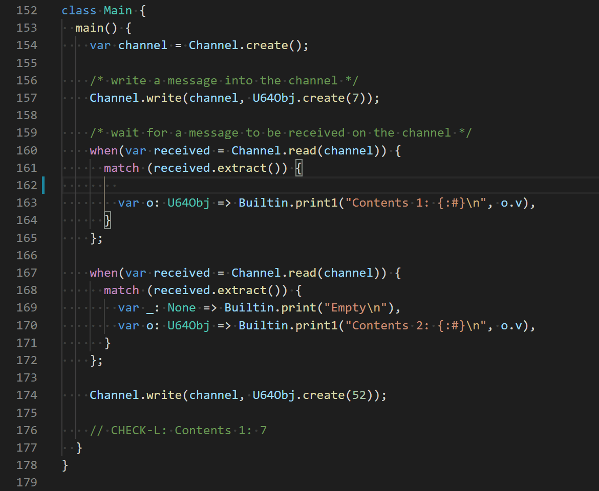

# Verona Syntax

## `vscode-verona-syntax`

Syntax highlighting for the [Verona](https://github.com/microsoft/verona) research language in VS Code.

## Current state

This extension is still a work in progress. It's loosely based off the Verona compiler's PEG grammar, but there are bound to be bugs and gaps, especially as Verona itself changes.

If you spot anything that just doesn't look right then [please file an issue or pull request!](https://github.com/KodrAus/vscode-verona-syntax/issues).
