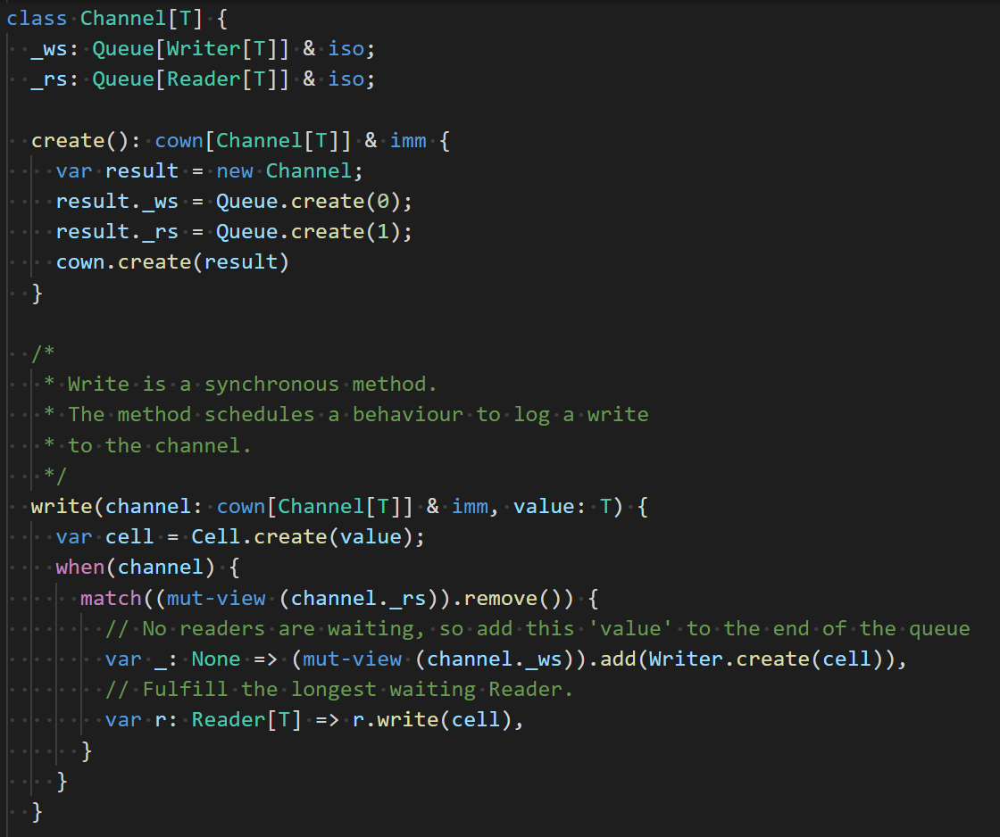

# `vscode-verona`

Syntax highlighting for the [Verona](https://github.com/microsoft/verona) research language in VS Code.

## Current state

This syntax highlighting probably has gaps in its support, and may become out-of-date as the Verona language itself evolves.
If you spot anything that just doesn't look right then PRs are welcome!
